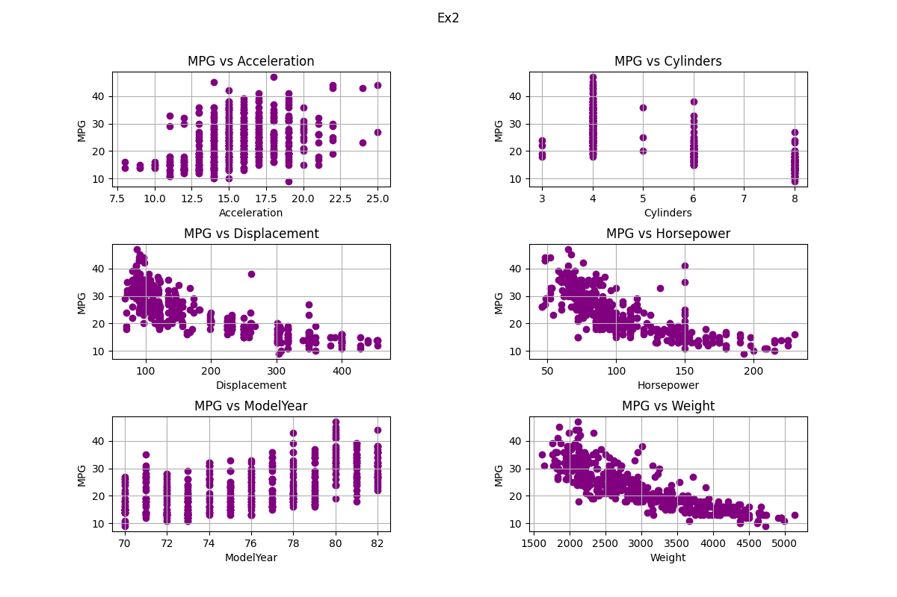

# Análise

## Exercício 2



> d. Comente a relação de MPG com as restantes variáveis.

`MPG` tem uma relação inversa com `Displacement`, `Horsepower`, `Weight`

Não existe uma relação significativa entre `MPG` e `Acceleration`

Houve um incremento no `MPG` ao longo dos anos.

Veículos com menos que 4 cilindros utilizam menos combustível por milhas

## Exercício 7

```sh
❯ ./src/ex7.py
Acceleration = 3.50 bits/symbol
Cylinders    = 1.59 bits/symbol
Displacement = 5.73 bits/symbol
Horsepower   = 5.84 bits/symbol
ModelYear    = 3.69 bits/symbol
Weight       = 8.39 bits/symbol
MPG          = 4.84 bits/symbol

bps(values) = 7.21 bits/symbol
```

> c. Comentar os resultados.


`Cylinders` é a variável com <font color="red">menor</font> __*entropia*__ e
`Weight` é a variável com <font color="red">maior</font> __*entropia*__.

Quanto maior a entropia, menor a incerteza.

Significando que, quando temos maior entropia então podemos identificar padrões repetitivos
na nossa fonte de dados e poder comprimi-los.

## Exercício 8

```sh
❯ ./src/ex8.py
--------------------
Variable: Weight
Codec:
<huffmancodec.huffmancodec.HuffmanCodec object at 0x7ffa55b44dd0>

Symbols:
[1613, 1649, 1755, 1760, 1773, 1795, 1800, 1825, 1834, 1835, 1836, 1845, 1850, 1867, 1875, 1915, 1925, 1937, 1940, 1945, 1950, 1955, 1963, 1965, 1968, 1970, 1975, 1978, 1980, 1985, 1990, 1995, 2000, 2003, 2019, 2020, 2025, 2035, 2045, 2046, 2050, 2051, 2065, 2070, 2074, 2075, 2085, 2100, 2108, 2110, 2120, 2123, 2124, 2125, 2126, 2130, 2135, 2144, 2145, 2150, 2155, 2158, 2160, 2164, 2171, 2188, 2189, 2190, 2200, 2202, 2205, 2210, 2215, 2219, 2220, 2223, 2226, 2228, 2230, 2234, 2245, 2246, 2254, 2255, 2264, 2265, 2278, 2279, 2288, 2290, 2295, 2300, 2310, 2320, 2330, 2335, 2350, 2370, 2372, 2375, 2379, 2380, 2385, 2391, 2395, 2401, 2405, 2408, 2420, 2430, 2434, 2451, 2464, 2472, 2489, 2490, 2500, 2506, 2511, 2515, 2525, 2542, 2545, 2556, 2560, 2565, 2572, 2575, 2582, 2585, 2587, 2592, 2595, 2600, 2605, 2615, 2620, 2625, 2634, 2635, 2639, 2640, 2648, 2660, 2665, 2670, 2671, 2672, 2678, 2694, 2700, 2702, 2711, 2720, 2725, 2735, 2740, 2745, 2755, 2774, 2789, 2790, 2795, 2800, 2807, 2815, 2830, 2833, 2835, 2855, 2865, 2868, 2870, 2875, 2890, 2900, 2901, 2904, 2905, 2910, 2914, 2930, 2933, 2945, 2950, 2957, 2962, 2965, 2979, 2984, 2990, 3003, 3012, 3015, 3021, 3035, 3039, 3060, 3070, 3085, 3086, 3090, 3102, 3121, 3139, 3140, 3150, 3155, 3158, 3160, 3169, 3190, 3193, 3205, 3210, 3211, 3221, 3230, 3233, 3245, 3250, 3264, 3265, 3270, 3278, 3282, 3288, 3302, 3329, 3336, 3353, 3360, 3365, 3380, 3381, 3399, 3410, 3415, 3420, 3425, 3430, 3432, 3433, 3436, 3439, 3445, 3449, 3459, 3465, 3504, 3520, 3525, 3530, 3535, 3563, 3570, 3574, 3605, 3609, 3613, 3620, 3630, 3632, 3645, 3651, 3664, 3672, 3693, 3725, 3730, 3735, 3755, 3761, 3777, 3781, 3785, 3820, 3821, 3830, 3840, 3850, 3870, 3880, 3892, 3897, 3900, 3907, 3940, 3955, 3962, 3988, 4034, 4042, 4054, 4055, 4060, 4077, 4080, 4082, 4096, 4098, 4100, 4129, 4135, 4140, 4141, 4142, 4154, 4165, 4166, 4190, 4209, 4215, 4220, 4237, 4257, 4274, 4278, 4294, 4295, 4312, 4325, 4335, 4341, 4354, 4360, 4363, 4376, 4380, 4382, 4385, 4422, 4425, 4440, 4456, 4457, 4464, 4498, 4499, 4502, 4615, 4633, 4638, 4654, 4657, 4668, 4699, 4732, 4735, 4746, 4906, 4951, 4952, 4955, 4997, 5140]

Lengths:
[9, 9, 9, 9, 9, 8, 8, 8, 9, 8, 9, 9, 9, 9, 9, 9, 9, 8, 9, 9, 8, 9, 9, 8, 9, 9, 8, 9, 9, 7, 8, 9, 9, 9, 9, 9, 9, 9, 8, 9, 9, 9, 8, 9, 9, 9, 9, 9, 9, 8, 9, 9, 9, 7, 9, 7, 9, 9, 9, 9, 7, 9, 9, 8, 9, 9, 9, 8, 9, 9, 9, 9, 9, 9, 8, 9, 9, 9, 9, 9, 9, 9, 9, 9, 9, 7, 9, 9, 9, 9, 9, 7, 9, 9, 9, 9, 9, 9, 9, 9, 9, 9, 9, 9, 8, 9, 9, 8, 9, 9, 9, 9, 9, 9, 9, 9, 9, 9, 9, 9, 9, 8, 9, 9, 9, 9, 9, 9, 9, 9, 9, 9, 9, 9, 9, 9, 9, 9, 9, 8, 9, 9, 9, 9, 9, 8, 9, 9, 9, 9, 9, 9, 9, 7, 9, 9, 9, 9, 9, 9, 9, 9, 9, 8, 9, 9, 9, 9, 9, 9, 9, 9, 9, 9, 9, 9, 9, 9, 9, 9, 9, 8, 9, 7, 8, 9, 9, 9, 9, 9, 9, 9, 9, 9, 9, 9, 9, 9, 9, 9, 9, 9, 9, 9, 9, 9, 9, 9, 9, 9, 9, 9, 9, 9, 9, 9, 9, 9, 9, 9, 9, 9, 9, 9, 9, 9, 9, 9, 9, 9, 8, 9, 9, 9, 9, 9, 8, 9, 9, 8, 9, 9, 9, 9, 9, 9, 9, 9, 9, 9, 9, 9, 9, 9, 9, 9, 9, 9, 9, 9, 9, 9, 8, 8, 8, 8, 7, 8, 7, 8, 8, 8, 8, 8, 8, 8, 8, 8, 8, 8, 7, 8, 8, 8, 8, 8, 8, 7, 8, 8, 8, 8, 8, 8, 8, 8, 8, 8, 8, 8, 8, 8, 8, 8, 8, 8, 8, 8, 8, 8, 8, 8, 7, 8, 8, 8, 8, 8, 8, 8, 8, 8, 8, 8, 8, 8, 8, 8, 8, 8, 8, 8, 8, 8, 8, 8, 7, 8, 8, 8, 8, 8, 8, 8, 8, 8, 8, 8, 8, 8, 8, 8, 8, 8, 8, 8]

--------------------

--------------------
Variable: Weight
Average bits per symbol: 8.601
Variance of lengths:     0.318
--------------------
```

> b. Compare com os resultados obtidos no ponto 7,
> e comente as suas observações.

Considerando a variável `Weight` como exemplo:

Dada a média teórica de bits por símbolo da variável como 8,39
e a média de bits por símbolo obtida através da codificação de Huffman como 8,601,
podemos dizer que a codificação de Huffman resultou em uma média de bits por símbolo
ligeiramente superior em comparação com o cálculo teórico.

Isto pode acontecer porque a codificação Huffman é um algoritmo de compressão de dados
sem perdas que atribui códigos mais curtos a símbolos que ocorrem com mais frequência
e códigos mais longos a símbolos que ocorrem com menos frequência.
Portanto, em situações em que alguns símbolos ocorrem com mais frequência do que outros
(o que geralmente é o caso),
a codificação de Huffman pode atingir uma taxa de compressão melhor do que o cálculo teórico,
que assume que todos os símbolos são igualmente prováveis.

É importante notar que a diferença entre os bits médios teóricos
e codificados por Huffman por símbolo é relativamente pequena
(apenas 0,211 bits por símbolo),
o que indica que a entropia da variável não é significativamente afetada
pelo uso da codificação de Huffman.

> c. Como se pode reduzir a variância dos comprimentos,
> e qual é a importância disto?

A variação de comprimento é a variabilidade dos comprimentos de diferentes símbolos
ou códigos usados para representar dados.
Geralmente, reduzir a variação de comprimento é desejável
porque torna o Huffman Coding mais eficiente e traz os seguintes beníficios:

1. Uso eficiente do armazenamento
2. Melhor transmissão de dados
3. Processamento de dados mais rápido
